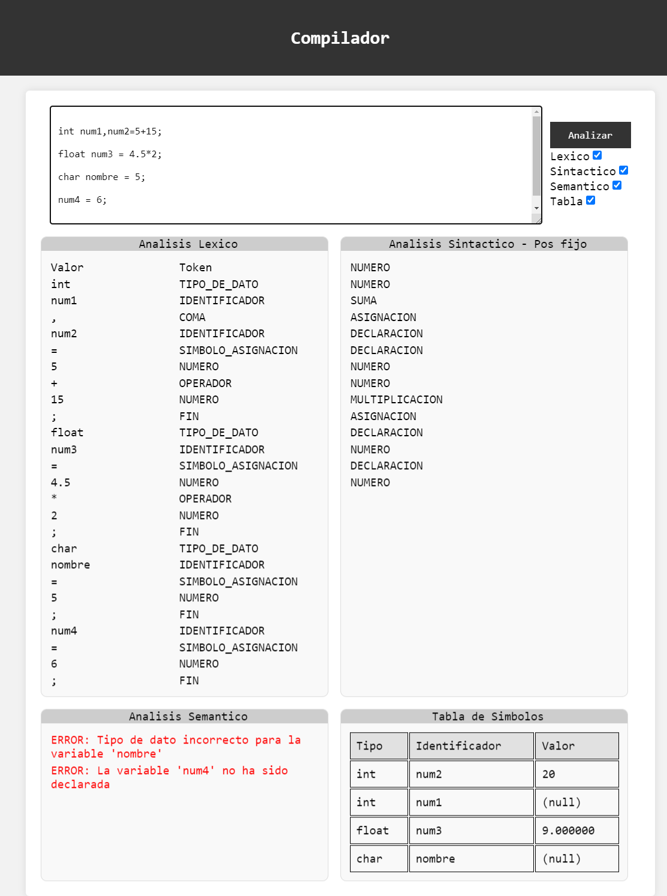
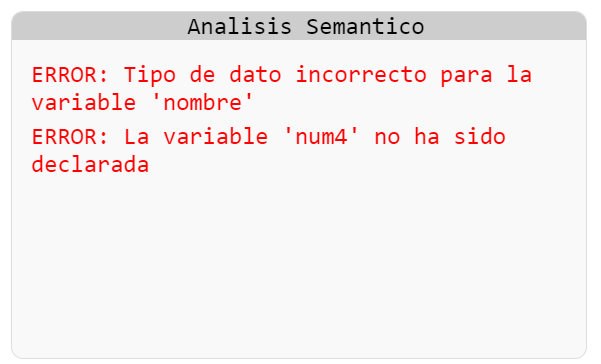
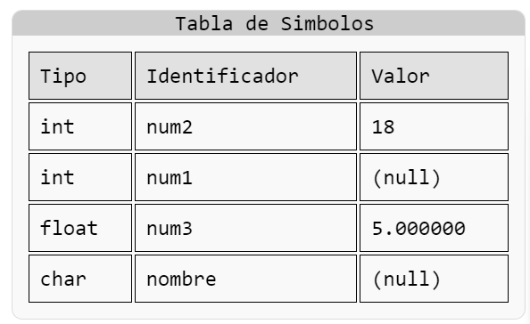

# Readme: Analizadores Léxico ,Sintáctico y Semantico en C y PHP

Este Readme proporciona información detallada del compilador, escritos en C, así como el código PHP y HTML asociado para crear una interfaz web.

Para [mas informacion](https://youtu.be/pKObh-1xLYg) vea el video de su funcionalidad en YouTube

## Analizador Léxico (`lexico.l`)
### Descripción

- `lexico.l` es un analizador léxico escrito en C utilizando Flex. Su función principal es escanear el código fuente de entrada y reconocer tokens, como identificadores, palabras clave, números y símbolos, para pasarlos al analizador sintáctico.

### Tokens Reconocidos

- Tipo de dato (`int`, `char`, `float`, `bool`, `void`)
- Palabras reservadas (`if`, `else`, `for`, `while`, `do`, `printf`, `scanf`, `main`)
- Identificadores (nombres de variables y funciones)
- Números (enteros y decimales)
- Símbolo de asignación (`=`)
- Operadores de comparación (`==`, `<`, `>`, `<=`, `>=`)
- Símbolos de puntuación (`;`, `{`, `}`, `(`, `)`)
- Operadores aritméticos (`+`, `-`, `*`, `/`)		
- Operadores de incremento (`++`)
- Constantes de cadena (cualquier texto entre comillas dobles)
- Impresión de variable (cualquier identificador precedido por `&`)
- Coma (`,`)

  

### Funciones Principales

- `yylex`: Esta función escanea el código fuente y devuelve tokens al analizador sintáctico.
- `print_tokens`: Imprime los tokens reconocidos.
- `add_token`: Agrega un token a la lista de tokens.
- `strndup`: Duplica una cadena hasta un número máximo de caracteres.
- `main`: Inicia el análisis léxico, imprime los tokens reconocidos, los tokens de sintaxis, los mensajes de error y la tabla de símbolos.

## Analizador Sintáctico (`sintactico.y`)

### Descripción

- `sintactico.y` es un analizador sintáctico escrito en C utilizando Bison. Su función es analizar la estructura del código fuente y construir un árbol de sintaxis abstracta. Además, registra los tokens en una estructura `Token` definida y proporciona una función para imprimirlos.

### Tokens de Sintaxis

Además de los tokens léxicos, el analizador también genera tokens de sintaxis que representan las estructuras sintácticas reconocidas, como declaraciones, asignaciones, bloques y funciones. Estos tokens se almacenan en una estructura `SyntaxToken` y se pueden imprimir con la función `print_syntax_tokens`.

### Producciones y Reglas

- El analizador sintáctico define una gramática que especifica las producciones y reglas de construcción del lenguaje. Las reglas de la gramática se definen en la sección de reglas del archivo `sintactico.y`.

### Funciones Principales

- `yyparse`: Inicia el análisis sintáctico y construye el árbol de sintaxis abstracta.
- `add_token`: Agrega un token a la estructura `Token`.
- `print_tokens`: Imprime los tokens reconocidos.
- `add_syntax_token`: Agrega un token de sintaxis a la lista de tokens de sintaxis.
- `print_syntax_tokens`: Imprime los

## Analizador Semántico (`sintactico.y`)

### Descripción

- En `sintactico.y`, el análisis semántico se realiza a través de varias funciones que verifican la compatibilidad de los tipos de datos, buscan variables en la tabla de símbolos, agregan nuevos símbolos a la tabla y asignan valores a las variables.

### Tabla de Símbolos

- La tabla de símbolos es una estructura de datos que almacena información sobre las variables y funciones definidas en el código fuente. En este caso, la tabla de símbolos se implementa como un array de estructuras `EntradaTablaSimbolos`.

### Funciones Principales

- `es_tipo_compatible`: Verifica si un valor es compatible con un tipo de dato específico.
- `buscar_indice_simbolo`: Busca un identificador en la tabla de símbolos y devuelve su índice.
- `agregar_valor`: Asigna un valor a una variable en la tabla de símbolos.
- `agregar_simbolo`: Agrega un nuevo símbolo a la tabla de símbolos.
- `buscar_valor`: Busca el valor de una variable en la tabla de símbolos.

### Manejo de Errores

- El analizador semántico también maneja errores, como la asignación de un valor incompatible a una variable, la redeclaración de una variable y el uso de una variable no declarada. Los mensajes de error se almacenan en una estructura `Error` y se pueden imprimir con la función `print_error_messages`.

## Página Principal (`index.php`)

### Descripción

- `index.php` es la página principal de la aplicación web. Esta página contiene el formulario de entrada para el código a analizar y muestra los resultados del análisis léxico, sintáctico y semántico.

### Funciones Principales

- `exec`: Ejecuta los comandos de shell para compilar y ejecutar los analizadores léxico y sintáctico.
- `addEventListener`: Escucha los eventos de click e input en el formulario y actualiza los resultados del análisis en tiempo real.
- `actualizarResultado`: Realiza una solicitud AJAX al servidor PHP para enviar la cadena de texto y recibir los resultados del análisis.

### Elementos de la Interfaz

- Formulario de entrada: Un área de texto donde los usuarios pueden ingresar el código a analizar.
- Botón de análisis: Un botón que, cuando se hace clic, inicia el análisis del código ingresado.
- Resultados del análisis: Cuatro secciones que muestran los resultados del análisis léxico, sintáctico, semántico y la tabla de símbolos.

### Estilos

- Los estilos de la página se definen en la sección `<style>` del archivo. Se utiliza un diseño simple y limpio con un esquema de color en su mayoría blanco y gris.

### Manejo de Errores

- Los errores se manejan en el lado del cliente con JavaScript y en el lado del servidor con PHP. Los mensajes de error se muestran en las secciones correspondientes de los resultados del análisis.

## Archivo de Procesamiento (analizar.php)

### Descripción

- El archivo PHP `analizar.php` recibe los datos del formulario de la interfaz web y utiliza los analizadores léxico y sintáctico para procesar el código fuente.
- Luego, devuelve los resultados al formato JSON para que la página web los muestre.

### Funciones Principales

- Procesa el código fuente recibido a través de `POST`.
- Ejecuta los analizadores C y obtiene los resultados.
- Devuelve los resultados al cliente en formato JSON.

Este conjunto de archivos permite analizar código fuente desde una interfaz web utilizando un analizador léxico y sintáctico escritos en C, proporcionando una forma interactiva de verificar la estructura y los tokens del código fuente.

<h2 style="font-size: 1.5rem; font-weight: 600; border-bottom: 2px solid #3182ce">Autor</h2>
 <table >
                <tbody id="simbolo">
                <tr><td style="display: flex;">

</td><td> 
                

Benjamin Tavarez 1-19-2141

Este proyecto fue desarrollado por <a href="https://github.com/SirBeho" style="color: #3182ce; text-decoration: underline;">Benjamin Tavarez</a>, como parte del programa de clase de la materia <a href="#" style="color: #3182ce; text-decoration: underline;">INF-920-001 COMPILADORES</a> impartida por el profesor <a href="https://imendozasoftware.com/" style="color: #3182ce; text-decoration: underline;">Ivan Mendoza</a>

Si tienes alguna pregunta o comentario sobre este proyecto, no dudes en ponerte en contacto conmigo a través de <a href="mailto:benjamin.tavarez.98@gmail.com" style="color: #3182ce; text-decoration: underline;">benjamin.tavarez.98@gmail.com</a> o en <a href="https://www.linkedin.com/in/benjamin-tavarez-cruceta-052aa623b/" style="color: #3182ce; text-decoration: underline;">LinkedIn</a>.

</td>         
  </tr>
  </tbody>
</table>